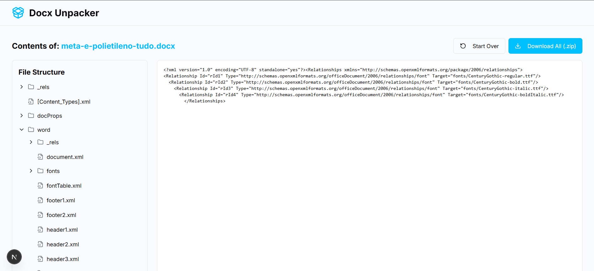

# Docx Unpacker Webapp


Lire en anglais : `README.md` | Lire en portugais : `README-pt-br.md`

Outil web construit avec Next.js pour ouvrir, inspecter et extraire le contenu des fichiers `.docx` directement dans le navigateur. Explorez la structure interne (XML et médias), visualisez les images, obtenez un aperçu de texte simple et téléchargez tout en `.zip`. L'application est multilingue, optimisée pour le SEO et prête pour le déploiement.

## Table des Matières
- Vue d'Ensemble
- Fonctionnalités
- Stack Technologique
- Architecture
- Captures d'Écran
- Premiers Pas
- Utilisation
- Internationalisation (i18n)
- SEO & Sitemap
- Structure du Projet
- Feuille de Route
- Tests & Qualité
- Contribuer
- Code de Conduite
- Sécurité
- Licence
- Maintenance
- Remerciements
- Support & FAQ

## Vue d'Ensemble
- Framework : `Next.js 15` (App Router) avec TypeScript.
- UI : `Tailwind CSS`, composants `shadcn/ui` et icônes `lucide-react`.
- Décompression : `JSZip` pour lire `.docx` (ZIP avec XML et médias).
- Multilingue : 20+ locales avec détection automatique via middleware.
- SEO : métadonnées par locale, Open Graph, Twitter, FAQ en JSON-LD, sitemap et `robots.txt`.
- Scripts utiles : `dev`, `build`, `start`, `lint`, `typecheck` et commandes optionnelles AI (Genkit).

## Fonctionnalités
- Upload de `.docx` via glisser-déposer ou sélecteur de fichiers.
- Arbre navigable des fichiers internes du `.docx`.
- Rendu direct des images.
- Aperçu de texte simple du `word/document.xml` (extraction naïve via balises `w:t`).
- Onglet "XML Brut" pour inspecter le XML formaté.
- Téléchargement de tous les fichiers extraits en `.zip`.
- Reset pour recommencer.
- Changement de langue via sélecteur.

## Stack Technologique
- `Next.js 15`, `React`, `TypeScript`
- `Tailwind CSS`, `shadcn/ui`, `lucide-react`
- `JSZip`
- i18n avec `negotiator`, `@formatjs/intl-localematcher`
- SEO intégré avec routes par locale

## Architecture
- Routes par locale : `src/app/[locale]`.
- Page principale : `src/app/[locale]/page.tsx` compose layout, composant de décompression et FAQ.
- Composant principal : `src/components/docx-unpacker.tsx`
  - Orchestre l'upload (`FileUpload`), décompression côté serveur (`unpackDocx`) et visualisation (`FileTree`/`FileViewer`).
  - Implémente le téléchargement `.zip` côté client avec `JSZip`.
  - État : chargement, erreur, contenu décompressé et fichier sélectionné.
- Server action : `src/app/actions.ts`
  - `unpackDocx(fileBuffer)` utilise `JSZip.loadAsync`.
  - Construit l'arbre `UnpackedFile` (répertoires/fichiers) en préservant les chemins.
  - Détection MIME basique dans `getMimeType` (png, jpg/jpeg, gif, svg, xml/rels) ; inconnus comme texte.
  - Texte/XML lu comme `string` ; images comme `base64`.
- Types : `src/lib/types.ts` (`UnpackedFile`).
- Utilitaires : `src/lib/utils.ts` (`cn`).

## Captures d'Écran
> Ajoutez de vraies captures d'écran quand disponibles.


## Premiers Pas
Prérequis :
- Node.js 18+ et npm.

Installation :
```
npm install
```

Développement (port `9002`) :
```
npm run dev
```

Build de production :
```
npm run build
```

Démarrage de production :
```
npm run start
```

Scripts utiles :
- `npm run lint` — linting.
- `npm run typecheck` — vérification des types.
- `npm run genkit:dev` / `npm run genkit:watch` — environnement dev Genkit (optionnel).

## Utilisation
- Visitez une route de locale (`/en`, `/pt`, `/es`, etc.). Le middleware redirige automatiquement depuis `/`.
- Uploadez un `.docx` via glisser-déposer ou cliquez sur "Parcourir les Fichiers".
- Attendez le traitement ; en cas d'erreur, cliquez sur "Réessayer".
- Utilisez l'arbre de fichiers à gauche pour naviguer.
- Cliquez sur un fichier pour visualiser :
  - Images : rendues directement.
  - `word/document.xml` : aperçu de texte simple (onglets "Aperçu"/"XML Brut").
  - Autres XML/texte : "XML Brut" formaté.
- "Télécharger Tout (.zip)" télécharge tout le contenu extrait.
- "Recommencer" remet à zéro l'état pour un nouvel upload.

## Internationalisation (i18n)
- Config : `i18n-config.ts` définit la locale par défaut et la liste supportée.
- Dictionnaires : `dictionaries/*.json` avec métadonnées, UI et FAQ par locale.
- Chargement : `get-dictionary.ts` importe dynamiquement le dictionnaire.
- Middleware : `middleware.ts` détecte la langue de l'utilisateur et redirige vers `/{locale}`.
- Sélecteur de langue : `src/components/language-switcher.tsx` change le segment locale de l'URL.
- Direction du texte & polices : `src/app/[locale]/layout.tsx` définit `dir` et polices spécifiques par locale.

## SEO & Sitemap
- Métadonnées par locale : `src/app/[locale]/layout.tsx` compose `title`, `description`, `keywords`, Open Graph et Twitter.
- FAQ JSON-LD : injecté dans le `head` du dictionnaire de la locale actuelle.
- Sitemap : `src/app/sitemap.ts` génère des entrées par locale ; mettez à jour `URL` avec votre domaine.
- Robots : `public/robots.txt` référence le sitemap ; ajustez le domaine.
- Images distantes : `next.config.ts` autorise `placehold.co`, `images.unsplash.com`, `picsum.photos`.

## Structure du Projet
```
docx-unpacker-webapp/
├── dictionaries/          # Métadonnées et chaînes par locale (JSON)
├── src/
│   ├── app/
│   │   ├── [locale]/      # Route par locale (layout, page)
│   │   ├── actions.ts     # Server action pour décompresser .docx
│   │   └── sitemap.ts     # Sitemap par locale
│   ├── components/
│   │   ├── docx-unpacker.tsx  # Flux principal upload/visualisation
│   │   ├── file-upload.tsx     # Upload (glisser & déposer)
│   │   ├── file-tree.tsx       # Arbre de fichiers
│   │   └── file-viewer.tsx     # Visualiseur et onglets
│   ├── get-dictionary.ts   # Chargeur de dictionnaire (import dynamique)
│   └── lib/
│       ├── types.ts        # Interface UnpackedFile
│       └── utils.ts        # Utilitaire cn
├── i18n-config.ts          # Configuration de locale
├── middleware.ts           # Redirige vers la locale la mieux correspondante
├── next.config.ts          # Config Next.js (images, lint/ts)
├── public/robots.txt       # Robots + référence sitemap
├── tailwind.config.ts      # Thème et polices spécifiques par locale
└── package.json            # Dépendances et scripts
```

## Feuille de Route
- Aperçu de texte avancé (préserver style et formatage).
- Support MIME plus large (audio, vidéo, polices, etc.).
- Exportation sélective et téléchargements de sous-dossiers.
- Améliorations de performance pour gros documents.
- Accessibilité (ARIA, navigation clavier).
- PWA / support hors ligne.
- Tests unitaires et d'intégration.

## Tests & Qualité
- Lint : `npm run lint`
- Types : `npm run typecheck`
- Formatage : suivez le style du projet (Tailwind + TypeScript).
- Évitez les changements non liés ; gardez les PRs focalisées et petites.

## Contribuer
- Forkez et créez une branche descriptive pour votre fonctionnalité/correction.
- Assurez-vous que lint et typecheck passent avant d'ouvrir une PR.
- Décrivez clairement le problème et la solution dans la PR.
- Traductions : ajoutez des entrées dans `dictionaries/*.json` en suivant le schéma.
- Modèles : maintenez la nomenclature, le style et l'organisation cohérents.

## Code de Conduite
- Considérez adopter [Contributor Covenant](https://www.contributor-covenant.org/) (ajoutez `CODE_OF_CONDUCT.md`).

## Sécurité
- Pour signaler des vulnérabilités, ouvrez une issue avec le label `security` ou ajoutez `SECURITY.md` avec les instructions de contact.

## Licence
- Définissez la licence du projet (ex : MIT ou Apache-2.0). Ajoutez `LICENSE` à la racine et un badge correspondant.

## Maintenance
- Mainteneurs : ajoutez noms/contacts ici.
- Les suggestions sont bienvenues via les issues.

## Remerciements
- Communautés Next.js, Tailwind CSS et shadcn/ui.
- Contributeurs et tous ceux qui signalent des bugs/idées.

## Support & FAQ
- Les questions fréquemment posées sont disponibles dans l'UI de l'app (FAQ par locale).
- Pour le support, ouvrez une issue détaillant l'environnement et les étapes de reproduction.

---

Besoin d'ajustements sur le contenu, les locales ou les intégrations ? Éditez `dictionaries/`, `sitemap.ts`, `robots.txt` et les composants liés comme décrit ci-dessus. Mettez à jour le domaine dans les sections SEO lors de la publication.
## 📸 Screenshots



