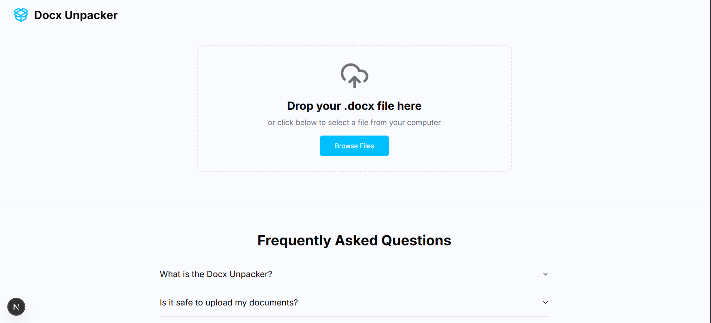
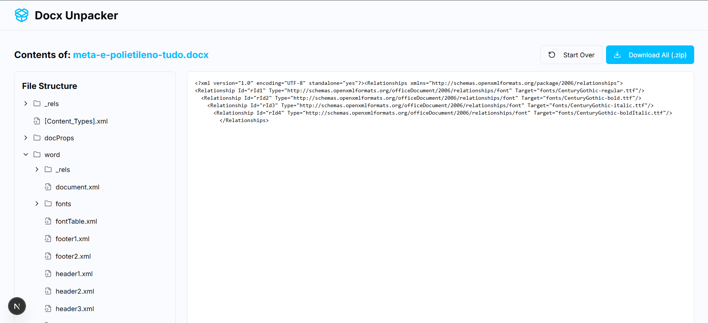

# DOCX Unpacker Web App

[](https://nextjs.org/)
[](https://www.typescriptlang.org/)
[](https://tailwindcss.com/)
[](https://reactjs.org/)
[](https://vercel.com/)

> **अन्य भाषाओं में पढ़ें:** [English](README.md) | [Português (Brasil)](README-pt-br.md) | [Español](README-es.md) | [Français](README-fr.md) | [Deutsch](README-de.md) | [日本語](README-ja.md) | [中文](README-zh.md) | **हिन्दी**

DOCX फ़ाइलों की सामग्री निकालने और प्रदर्शित करने के लिए एक आधुनिक वेब एप्लिकेशन। Next.js, TypeScript, और Tailwind CSS के साथ बनाया गया, बहुभाषी समर्थन और SEO अनुकूलन के साथ।

## 📋 अवलोकन

DOCX Unpacker Web App एक वेब एप्लिकेशन है जो उपयोगकर्ताओं को Microsoft Word दस्तावेज़ (.docx) अपलोड करने और उनकी सामग्री को सीधे वेब ब्राउज़र में देखने की अनुमति देता है। यह एप्लिकेशन दस्तावेज़ की सामग्री निकालता है और इसे संरचित, पढ़ने योग्य प्रारूप में प्रदर्शित करता है।

### ✨ मुख्य विशेषताएं

- 📄 **DOCX फ़ाइल अपलोड**: ड्रैग एंड ड्रॉप या क्लिक करके फ़ाइल चुनें
- 🔍 **सामग्री निष्कर्षण**: दस्तावेज़ टेक्स्ट, छवियां और तालिकाएं निकालें
- 🎨 **रेस्पॉन्सिव डिज़ाइन**: सभी डिवाइसों के लिए अनुकूलित प्रदर्शन
- 🌍 **बहुभाषी समर्थन**: 21 भाषाओं का समर्थन
- ⚡ **तेज़ प्रसंस्करण**: क्लाइंट-साइड कुशल फ़ाइल प्रसंस्करण
- 🔒 **गोपनीयता-केंद्रित**: फ़ाइलें स्थानीय रूप से संसाधित होती हैं, सर्वर पर नहीं भेजी जातीं
- 🎯 **SEO अनुकूलित**: खोज इंजन के लिए अनुकूलित
- 📱 **PWA तैयार**: प्रगतिशील वेब एप्लिकेशन सुविधाएं

## 🛠️ तकनीकी स्टैक

- **फ्रेमवर्क**: Next.js 14 (App Router)
- **भाषा**: TypeScript
- **स्टाइलिंग**: Tailwind CSS
- **UI घटक**: Radix UI
- **आइकन**: Lucide React
- **फ़ाइल प्रसंस्करण**: JSZip, xml2js
- **अंतर्राष्ट्रीयकरण**: next-intl
- **तैनाती**: Vercel
- **AI एकीकरण**: Google Genkit (वैकल्पिक)

## 🏗️ आर्किटेक्चर

```
उपयोगकर्ता → फ़ाइल अपलोड → क्लाइंट-साइड प्रसंस्करण → सामग्री प्रदर्शन
    ↓
[ब्राउज़र] → [JSZip] → [XML पार्सिंग] → [React प्रदर्शन]
```

### मुख्य घटक

1. **फ़ाइल अपलोडर**: ड्रैग एंड ड्रॉप इंटरफ़ेस
2. **DOCX पार्सर**: फ़ाइल सामग्री निष्कर्षण और विश्लेषण
3. **सामग्री रेंडरर**: संरचित सामग्री प्रदर्शन
4. **बहुभाषी सिस्टम**: गतिशील भाषा स्विचिंग
5. **SEO घटक**: मेटाडेटा और साइटमैप जेनरेशन

## 📸 स्क्रीनशॉट

*नोट: स्क्रीनशॉट भविष्य में जोड़े जाएंगे*

## 🚀 शुरुआत करना

### पूर्वापेक्षाएं

- Node.js 18.0 या उच्चतर
- npm, yarn, pnpm, या bun

### स्थापना

1. रिपॉजिटरी क्लोन करें:
```bash
git clone https://github.com/yourusername/docx-unpacker-webapp.git
cd docx-unpacker-webapp
```

2. निर्भरताएं स्थापित करें:
```bash
npm install
# या
yarn install
# या
pnpm install
```

3. विकास सर्वर शुरू करें:
```bash
npm run dev
# या
yarn dev
# या
pnpm dev
```

4. ब्राउज़र में [http://localhost:3000](http://localhost:3000) खोलें

## 📖 उपयोग

### बुनियादी उपयोग

1. **फ़ाइल अपलोड**: DOCX फ़ाइल को ड्रैग एंड ड्रॉप करें या क्लिक करके चुनें
2. **प्रसंस्करण की प्रतीक्षा**: एप्लिकेशन स्वचालित रूप से फ़ाइल को संसाधित करता है
3. **सामग्री देखें**: निकाली गई सामग्री संरचित प्रारूप में प्रदर्शित होती है
4. **भाषा स्विच**: ऊपरी दाएं कोने में भाषा चयनकर्ता का उपयोग करके भाषा बदलें

### समर्थित फ़ाइल प्रारूप

- `.docx` - Microsoft Word दस्तावेज़ (2007 और बाद के संस्करण)

### सीमाएं

- अधिकतम फ़ाइल आकार: 10MB
- जटिल स्वरूपण सरल हो सकता है
- मैक्रो या VBA कोड समर्थित नहीं है

## 🌍 अंतर्राष्ट्रीयकरण (i18n)

यह एप्लिकेशन निम्नलिखित 21 भाषाओं का समर्थन करता है:

- 🇸🇦 العربية (ar)
- 🇪🇬 العربية المصرية (arz)
- 🇧🇩 বাংলা (bn)
- 🇩🇪 Deutsch (de)
- 🇺🇸 English (en)
- 🇪🇸 Español (es)
- 🇫🇷 Français (fr)
- 🇮🇳 हिन्दी (hi)
- 🇮🇩 Bahasa Indonesia (id)
- 🇯🇵 日本語 (ja)
- 🇳🇱 Nederlands (nl)
- 🇳🇬 Nigerian Pidgin (pcm)
- 🇧🇷 Português (pt)
- 🇷🇺 Русский (ru)
- 🇮🇳 தமிழ் (ta)
- 🇮🇳 తెలుగు (te)
- 🇹🇷 Türkçe (tr)
- 🇵🇰 اردو (ur)
- 🇻🇳 Tiếng Việt (vi)
- 🇭🇰 粵語 (yue)
- 🇨🇳 中文 (zh)

### नई भाषा जोड़ना

1. `messages/` निर्देशिका में नई भाषा फ़ाइल बनाएं
2. `src/i18n/request.ts` में भाषा कॉन्फ़िगर करें
3. संबंधित README फ़ाइल बनाएं

## 🔍 SEO & साइटमैप

- **गतिशील मेटाडेटा**: प्रत्येक भाषा के लिए अनुकूलित मेटा टैग
- **संरचित डेटा**: JSON-LD प्रारूप में स्कीमा मार्कअप
- **स्वचालित साइटमैप**: सभी भाषाओं और पृष्ठों सहित
- **Open Graph**: सामाजिक मीडिया साझाकरण अनुकूलन
- **Twitter Cards**: बेहतर Twitter साझाकरण

## 📁 प्रोजेक्ट संरचना

```
docx-unpacker-webapp/
├── src/
│   ├── app/                 # Next.js App Router
│   ├── components/          # React घटक
│   ├── lib/                 # उपयोगिता फ़ंक्शन
│   ├── i18n/               # अंतर्राष्ट्रीयकरण कॉन्फ़िगरेशन
│   └── ai/                 # AI एकीकरण (वैकल्पिक)
├── messages/               # अनुवाद फ़ाइलें
├── public/                 # स्थिर संपत्ति
├── README-*.md            # भाषा-विशिष्ट README
└── package.json           # प्रोजेक्ट कॉन्फ़िगरेशन
```

## 🗺️ रोडमैप

### अल्पकालिक लक्ष्य
- [ ] फ़ाइल प्रसंस्करण में सुधार
- [ ] अधिक फ़ाइल प्रारूपों का समर्थन
- [ ] प्रदर्शन अनुकूलन
- [ ] पहुंच में सुधार

### मध्यकालिक लक्ष्य
- [ ] बैच फ़ाइल प्रसंस्करण
- [ ] उन्नत स्वरूपण समर्थन
- [ ] निर्यात सुविधाएं
- [ ] उपयोगकर्ता प्राथमिकताएं

### दीर्घकालिक लक्ष्य
- [ ] क्लाउड स्टोरेज एकीकरण
- [ ] सहयोग सुविधाएं
- [ ] API विकास
- [ ] मोबाइल ऐप

## 🧪 परीक्षण और गुणवत्ता

```bash
# परीक्षण चलाएं
npm run test

# लिंटर चलाएं
npm run lint

# प्रकार जांच
npm run type-check

# बिल्ड
npm run build
```

## 🤝 योगदान

योगदान का स्वागत है! कृपया इन चरणों का पालन करें:

1. प्रोजेक्ट को फोर्क करें
2. फीचर ब्रांच बनाएं (`git checkout -b feature/amazing-feature`)
3. परिवर्तन कमिट करें (`git commit -m 'Add amazing feature'`)
4. ब्रांच में पुश करें (`git push origin feature/amazing-feature`)
5. Pull Request खोलें

विस्तृत जानकारी के लिए [CONTRIBUTING.md](CONTRIBUTING.md) देखें।

## 📜 आचार संहिता

यह प्रोजेक्ट [Contributor Covenant](CODE_OF_CONDUCT.md) आचार संहिता को अपनाता है। भाग लेकर, आप इस संहिता का पालन करने के लिए सहमत हैं।

## 🔒 सुरक्षा

यदि आप सुरक्षा भेद्यता की खोज करते हैं, तो कृपया [SECURITY.md](SECURITY.md) में निर्देशों का पालन करके रिपोर्ट करें।

## 📄 लाइसेंस

यह प्रोजेक्ट [MIT License](LICENSE) के तहत लाइसेंस प्राप्त है।

## 🔧 रखरखाव

- **सक्रिय रखरखाव**: यह प्रोजेक्ट सक्रिय रूप से बनाए रखा जाता है
- **मुद्दा प्रतिक्रिया**: आमतौर पर 24-48 घंटों के भीतर प्रतिक्रिया
- **अपडेट आवृत्ति**: नियमित निर्भरता अपडेट और सुरक्षा पैच

## 🙏 स्वीकृतियां

- Next.js टीम - शानदार फ्रेमवर्क के लिए धन्यवाद
- Tailwind CSS टीम - सुंदर स्टाइलिंग सिस्टम के लिए धन्यवाद
- ओपन सोर्स समुदाय - निरंतर समर्थन के लिए धन्यवाद

## 📞 समर्थन और FAQ

### अक्सर पूछे जाने वाले प्रश्न

**प्रश्न: कौन से फ़ाइल प्रारूप समर्थित हैं?**
उत्तर: वर्तमान में केवल .docx (Microsoft Word 2007 और बाद के संस्करण) फ़ाइलें समर्थित हैं।

**प्रश्न: क्या फ़ाइलें सर्वर पर भेजी जाती हैं?**
उत्तर: नहीं, सभी प्रसंस्करण ब्राउज़र में होता है और फ़ाइलें सर्वर पर नहीं भेजी जाती हैं।

**प्रश्न: अधिकतम फ़ाइल आकार क्या है?**
उत्तर: वर्तमान सीमा 10MB है।

### समर्थन प्राप्त करना

- 🐛 बग रिपोर्ट: [GitHub Issues](https://github.com/yourusername/docx-unpacker-webapp/issues)
- 💡 फीचर अनुरोध: [GitHub Discussions](https://github.com/yourusername/docx-unpacker-webapp/discussions)
- 📧 प्रत्यक्ष संपर्क: [your-email@example.com](mailto:your-email@example.com)

---

<div align="center">

**[⬆ शीर्ष पर वापस जाएं](#docx-unpacker-web-app)**

Made with ❤️ by [Your Name](https://github.com/yourusername)

</div>
## 📸 Screenshots



