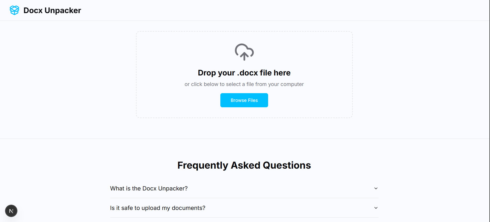

# Docx Unpacker Webapp — Urdu (ur)

بنیادی دستاویزات: `README.md` (انگریزی). پرتگالی (برازیل): `README-pt-br.md`.

یہ فائل README کے اردو ترجمہ کے لیے مخصوص ہے۔ ترجمہ اور دیکھ بھال میں مدد کا خیرمقدم کیا جاتا ہے۔

خلاصہ
- Next.js 15, TypeScript, Tailwind CSS, shadcn/ui
- JSZip کے ذریعے براؤزر میں `.docx` اَن پیک کریں
- فائل ٹری، تصویر کا پیش منظر، خام XML، سادہ متن پیش منظر
- کثیر لسانی سپورٹ اور لوکیل پر مبنی SEO
## 📸 Screenshots

